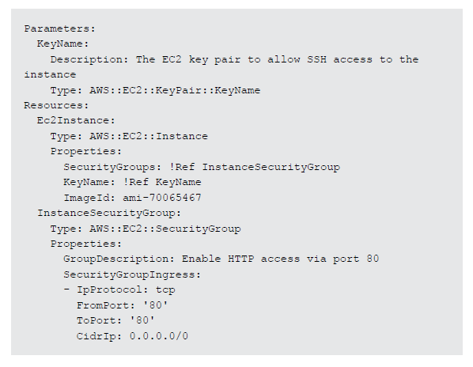

# Introducción a la Infraestructura como Código

La administración de la infraestructura es un proceso asociado con la ingeniería del software. Las organizaciones tiene tradicionalmente hardware "montado y apliado", y luego han instalado y configurado sistemas operativos y aplicaciones para soportar sus necesidades tecnológicas. La computación en la nube toma ventaja de la virtualización para habilitar aprovisionar bajo demanda cómputo, red y recursos de almacenamiento que constituyen infraestructuras tecnológicas.

Los gerentes de infraestructura a menudo han tenido que configurar dicho aprovisionamiento manualmente. El proceso manual tiene ciertas desventajas, incluyendo:

* Costos altos ya que necesitan capital humano que puede ir hacia otras necesidades del negocia más importantes.

* Inconsistencia debido al error humano, conduciendo a desviaciones del estándar de configuración.

* Falta de agilidad al limitar la velocidad a la que la organización puede lanzar nuevas versiones de servicios en respuesta a las necesidades e indicadores de mercado.

* Dificultad en alcanzar y mantener conformidad a la corporación o estándares de la industria debido a la falta de procesos repetibles.

Infraestructura como Código aborda estas deficiencias al traer automatización al proceso de aprovisionamiento. En lugar de confiar en ejecutar pasos manuales, tanto administradores como desarrolladores pueden instanciar infraestructura usando archivos de configuración. Infraestructura como Código trata estos archivos de configuración como código también. Estos archivos pueden ser usados para producir un conjunto de artefactos, es decir, servicios de cómputo, almacenamiento, red y de aplicación que comprenden un ambiente operando. Infraestructura como Código elimina la desviación de la configuración a través de automatización, de este modo incrementa la velocidad y agilidad del despliegue de infraestructura.

# El Ciclo de Vida de los Recursos de Infraestructura

En la sección anterior, presentamos Infraestructura como Código como una manera de aprovisionar recursos de una manera repetible y consistente. Los conceptos subyacentes son también relevantes para las funciones más altas de la operación de infraestructura tecnológica. Considera el siguiente diagrama.


La Figura 1 ilustra una vista normal del ciclo de vida de los recursos de infraestructura en una organización. Las etapas del ciclo de vida son como sigue:

1. **Aprovisionamiento de Recursos.** Los administradores aprovisionan los recursos de acuerdo a las especificaciones que ellos quieren.

2. **Gestión de Configuración.** Los recursos se vuelven componentes de un sistema de gestión de configuración que soportan actividades tales como afinación y parcheo.

3. **Supervisión y Rendimiento.** Herramientas de supervisión y rendimiento validan el estado operacional de los recursos examinando items como métricas, transacciones sintéticas y archivos de registro.

4. **Gobernanza y Conformidad.** Los marcos de trabajo de conformidad y gobernanza manejan validación adicional para asegurar el alineamiento con la corporación y los estándares de la industria, así como requerimientos regulatorios.

5. **Optimización de Recursos.** Los administradores revisan datos de rendimiento e identifican cambios necesarios para optimizar el ambiente alrededor de los criterios tales como rendimiento y manejo de costos.

Cada etapa involucra procedimientos que pueden aprovecharse en código. Esto extiende los beneficios de la Infraestructura como Código de su rol tradicional de aprovisionar al ciclo de vida entero. Cada ciclo de vida entonces se beneficia de la consistencia y repetitividad que la Infraestructura como Código ofrece. Esta vista expandida de la Infraestructura como Código resulta en grados más altos de madurez en la organización de  la Tecnología de Información (TI) como un todo.

En la siguiente sección, explicaremos cada etapa del ciclo de vida -- aprovisionamiento, gestión de configuración, supervisión y rendimiento, gobernanza y conformidad, y optimización. Vamos a considerar varias tareas asociadas con cada etapa y discutiremos cómo realizar esas tareas usando la capacidad de Amazon Web Services (AWS).

# Aprovisionamiento de Recursos

El ciclo de vida de recursos de información comienza con el aprovisionamiento de recursos. Los administradores pueden usar este principio de Infraestructura como Código para coordinar el proceso de aprovisionamiento. Considera las siguientes situaciones:

* Un gerente de publicaciones necesita construir una réplica de un ambiente productivo basado en la nube para propósitos de recuperación de desastres. Los administradores diseñan una plantilla que modela el ambiente de producción y aprovisiona infraestructura idéntica en la ubicación de recuperación de desastres.

* Un profesor de la Universidad quiere aprovisionar recursos para las clases de cada semestre. Los estudiantes en la clase necesitan un ambiente que contiene las herramientas apropiadas para sus estudios. El profesor crea una plantilla con los componentes de infraestructura apropiados, y luego instancia la plantilla de recursos para cada estudiante como sea necesario.

* Un servicio que tiene que cumplir con ciertos estándares de protección de la industria con un conjunto de controles cada vez que el servicio es instalado. El administrador de seguridad integra los controles de seguridad dentro de la plantilla de configuración para que los controles de seguridad sean instanciados con la infraestructura.

* El gerente de un proyecto de desarrollo necesita proveer ambientes de desarrollo para los programadores que incluyen las herramientas necesarias y con la capacidad de poder interactuar con una plataforma de integración continua. El gerente crea una plantilla de recursos y publica la plantilla en un catálogo de recursos. Esto habilita a los miembros del equipo para aprovisionar sus propios ambientes conforme sea necesario.

Estas situaciones tienen una cosa en común: la necesidad de un proceso repetible para instanciar recursos consistentemente. Infraestructura como Código provee un marco de trabajo para dicho proceso. Para atender esta necesidad, AWS ofrece AWS CloudFormation.

## AWS CloudFormation

AWS CloudFormation da a los desarrolladores y administradores de sistemas una manera fácil de crear, manejar, aprovisionar y actualizar una colección de recursos relacionados de AWS en una manera ordenada y predecible. AWS CloudFormation usa plantillas escritas en formato JSON o YAML para describir la colección de recursos de AWS (conocido como una pila), sus dependencias asociadas y cualquier parámetro en tiempo de ejecución. Puedes usar una plantilla para repetidamente para crear copias idénticas de la misma pila consistentemente a través de una región de AWS. Luego de lanzar los recursos, puedes modificarlos y actualizarlos de una manera controlada y predecible. En efecto, estas aplicando control de versiones a tu infraestructura de AWS de la misma manera como lo harías con tu código de aplicación. 

### Anatomía de la Plantilla

La figura 2 muestra un fragmento de una plantilla básica de AWS CloudFormation en formato YAML. Las plantillas contienen parámetros, declaración de recursos y salidas. Las plantillas pueden referencias las salidas de otras plantillas, lo cual habilita la modularización. 


La figura 3 es un ejemplo de una plantilla de AWS CloudFormation. La plantilla solicita el nombre del par de llaves de una instancia EC2 del usuario en la sección de parámetros. La sección de recursos de la plantilla luego crea una instancia EC2 usando el par de llaves, con un grupo de seguridad EC2 que habilita acceso HTTP (puerto 80 TCP).



### Conjunto de Cambios

Tú puedes actualizar las plantillas de AWS CloudFormation con código fuente de aplicación para agregar, modificar o borrar pilas de recursos. La característica del conjunto de cambios te habilita para tener una vista anticipada de los cambios propuestos a una pila sin aplicar las actualizaciones asociadas. Tú puedes controlar la habilidad de crear y ver los conjuntos de cambios usando AWS IAM. Puedes permitir a algunos desarrolladores crear y pre visualizar los conjuntos de cambios, mientras reservas la habilidad de actualizar las pilas o ejecutar el conjunto de cambios a unos pocos. Por ejemplo, podrías permitir a un desarrollador ver el impacto de un cambio en una plantilla antes de promover ese cambio a la etapa de pruebas.

Hay tres fases primordiales con el uso del conjunto de cambios.

1. **Crear el conjunto de cambio.** Para crear un conjunto de cambios para una pila, envía los cambios a la plantilla o como parámetros de AWS CloudFormation.

2. **Ver el conjunto de cambios.** Puedes usar la consola de AWS CloudFormation, AWS CLI o el API de AWS CloudFormation para ver los conjuntos de cambios. La consola de AWS CloudFormation provee un resumen de los cambios y un detalle de los cambios en formato JSON. La línea de comandos (CLI) de AWS y el API de CloudFormation regresan una lista detallada de cambios en formato JSON.

3. **Ejecutar el conjunto de cambios.** Puedes seleccionar y ejecutar el conjunto de cambios en la consola de AWS CloudFormation, usar el comando de "aws cloudformation execute-change-set" en el AWS CLI o el “ExecuteChangeSet” en el API.

La capacidad del conjunto de cambios te permite ir más allá del control de versiones en AWS CloudFormation habilitante para mantener un registro de que realmente se cambiará de una versión a otra. Los desarrolladores y administradores de sistemas pueden ganar más visión dentro del impacto de cambios antes de promoverlos y minimizar el riesgo de introducir errores.

### Plantillas Reusables

Muchos lenguajes de programación ofrecen maneras de modularizar código con construcciones como funciones y subrutinas. Del mismo modo, AWS CloudFormation ofrece múltiples maneras para manejar y organizar tus pilas, plantillas grandes de una sola pila puede volverse difícil de manejar. Hay incluso una gran posibilidad de encontrarse con un número de limitaciones de AWS CloudFormation.

Cuando se diseña la arquitectura de tu pila de AWS CloudFormation, puedes agrupar las pilas lógicamente por función. En lugar de crear una sola plantilla que incluye todos los recursos que necesitas, así como VPCs, subnets y security groups, puedes usar pilas anidadas o referencias cruzadas entre pilas.

La característica de  pilas anidadas te permite crear una nueva pila de recursos de AWS CloudFormation dentro de la plantilla de AWS CloudFormation y establecer una relación padre/hijo entre las dos pilas. Cada vez que creas una pila de AWS CloudFormation desde la plantilla padre, AWS CloudFormation también crea una pila hija. Este enfoque te permite compartir infraestructura como código a través de proyectos mientras se mantienen pilas completamente separadas para cada proyecto.

La referencia cruzada entre pilas habilita la exportación de valores de una pila de AWS CloudFormation para que otra pila de AWS CloudFormation pueda importarla. La referencia cruzada entre pilas promueve un modelo orientado a servicios con bajo acoplamiento que te permite compartir un solo conjunto de recursos a través de múltiples proyectos.

### Plantillas Lint

Así como con el código de aplicación, las plantillas de AWS CloudFormation deben pasar por una forma de análisis estático, también conocido como Lint. El objetivo de lint es determinar si el código es sintácticamente correcto, identificar error potenciales, y evaluar la adherencia a guías específicas. En AWS CloudFormation, lint valida que una plantilla está escrita correctamente ya sea en JSON o YAML.

AWS Cloudformation provee la API **_ValidateTemplate_*** *que chequea una sintaxis apropiada para JSON o YAML. Si el chequeo falla, AWS CloudFormation regresa un error de validación de la plantilla. Por ejemplo, tú puedes correr el siguiente comando para validar una plantilla almacenada en Amazon S3:

```
aws cloudformation validate-template --template-url \ 
s3://examplebucket/example_template.template
```

También puedes usar herramientas de validación de terceros. Por ejemplo, cfn-nag realiza evaluaciones adicionales en plantillas para buscar posibles preocupaciones de seguridad. Otra herramienta, cfn-check, realiza chequeos más profundos en especificaciones de recursos para identificar potenciales errores antes de que se junten al momento de crear la pila.

### Mejores Prácticas

La guía de usuario de AWS CloudFormation ofrece una lista de prácticas para diseñar e implementar plantillas de AWS CloudFormation. Nosotros proveemos los vínculos a estas prácticas abajo.

**Planeamiento y organización**

* [Organice sus pilas por ciclo de vida y titularidad](http://docs.aws.amazon.com/es_es/AWSCloudFormation/latest/UserGuide/best-practices.html#organizingstacks)

* [Utilice IAM para controlar el acceso](http://docs.aws.amazon.com/es_es/AWSCloudFormation/latest/UserGuide/best-practices.html#use-iam-to-control-access)

* [Reutilice plantillas para replicar pilas en varios entornos](http://docs.aws.amazon.com/es_es/AWSCloudFormation/latest/UserGuide/best-practices.html#reuse)

* [Utilice pilas anidadas para reutilizar patrones de plantillas comunes](http://docs.aws.amazon.com/es_es/AWSCloudFormation/latest/UserGuide/best-practices.html#nested)

* [Utilice referencias de pila cruzadas para exportar recursos compartidos](http://docs.aws.amazon.com/es_es/AWSCloudFormation/latest/UserGuide/best-practices.html#cross-stack)

**Creación de plantillas**

* [No integre credenciales en sus plantillas](http://docs.aws.amazon.com/es_es/AWSCloudFormation/latest/UserGuide/best-practices.html#creds)

* [Utilice tipos de parámetros específicos de AWS](http://docs.aws.amazon.com/es_es/AWSCloudFormation/latest/UserGuide/best-practices.html#parmtypes)

* [Utilice las limitaciones de los parámetros](http://docs.aws.amazon.com/es_es/AWSCloudFormation/latest/UserGuide/best-practices.html#parmconstraints)

* [Utilice AWS::CloudFormation::Init para implementar aplicaciones de software en las instancias de Amazon EC2](http://docs.aws.amazon.com/es_es/AWSCloudFormation/latest/UserGuide/best-practices.html#cfninit)

* [Utilice los scripts auxiliares más recientes](http://docs.aws.amazon.com/es_es/AWSCloudFormation/latest/UserGuide/best-practices.html#helper-scripts)

* [Valide las plantillas antes de usarlas](http://docs.aws.amazon.com/es_es/AWSCloudFormation/latest/UserGuide/best-practices.html#validate)

**Gestión de plantillas**

* [Administre todos los recursos de pila a través de AWS CloudFormation](http://docs.aws.amazon.com/es_es/AWSCloudFormation/latest/UserGuide/best-practices.html#donttouch)

* [Cree conjuntos de cambios antes de actualizar las pilas](http://docs.aws.amazon.com/es_es/AWSCloudFormation/latest/UserGuide/best-practices.html#cfn-best-practices-changesets)

* [Utilice políticas de pila](http://docs.aws.amazon.com/es_es/AWSCloudFormation/latest/UserGuide/best-practices.html#stackpolicy)

* [Utilice AWS CloudTrail para registrar las llamadas de AWS CloudFormation](http://docs.aws.amazon.com/es_es/AWSCloudFormation/latest/UserGuide/best-practices.html#cloudtrail)

* [Utilice revisiones de código y controles de revisión para administrar las plantillas](http://docs.aws.amazon.com/es_es/AWSCloudFormation/latest/UserGuide/best-practices.html#code)

* [Actualice con regularidad las instancias Linux de Amazon EC2](http://docs.aws.amazon.com/es_es/AWSCloudFormation/latest/UserGuide/best-practices.html#update-ec2-linux)

## Resumen

El ciclo de vida de la información de los recursos empieza con el aprovisionamiento de los recursos. AWS CloudFormation provee un modelo basado en plantillas para crear infraestructura y manejar las dependencias entre recursos durante el proceso de creación. Con AWS CloudFormation, usted puede mantener su infraestructura así como la fuente del código de aplicación.

# Gestión de Configuración

Una vez que la provisión los recursos de infraestructura y la infraestructura está arriba y corriendo, debes dirigirte a las necesidades del ambiente de la gestión de configuración. Considera las siguientes situaciones:

* Un gerente de lanzamiento quiere desplegar la versión de una aplicación a través de un grupo de servidores y realizar una reversión si hay problemas.

* Un administrador de sistemas recibe una solicitud para instalar un nuevo paquete del sistema operativo en los ambientes de los desarrollo, pero deja los otros ambientes intocables.

* Un administrador de aplicaciones necesita periódicamente actualizar un archivo de configuración a través de todos los servidores que están alojando una aplicación.

Una manera de abordar estas situaciones es regresar a la etapa de aprovisionamiento, aprovisionar recursos frescos con los cambios requeridos, y luego disponer de los recursos antiguos. Este enfoque, también conocido como infraestructura inmutable, asegura que los recursos provisionados son construidos de nuevo acorde a la línea base del código cada vez que un cambio es hecho. Esto elimina la desviación de configuración.

Hay veces, sin embargo, cuando quisieras tomar un enfoque distinto. En ambientes que tienen altos niveles de durabilidad, puede ser preferible tener maneras de hacer cambios incrementales a los recursos existentes en lugar de reaprovisionarlos. Para abordar esta necesidad, AWS ofrece Amazon Systems Manager y AWS OpsWorks para Chef Automate.

## Amazon EC2 Systems Manager

Amazon EC2 Systems Manager es una colección de capacidades que simplifican mantenimientos comunes, gestión, despliegue, y ejecución de tareas operacionales en instancias EC2 y servers o máquinas virtuales (MV) en las instalaciones físicas. Systems Manager te ayuda a entender y controlar fácilmente el estado actual de tus instancias EC2 y las configuraciones del SO. Puedes llevar registro y administrar remotamente configuraciones del sistema, niveles de parche del SO, configuración de aplicaciones, y otros detalles acerca de los despliegues como vayan ocurriendo en el tiempo. Estas capacidades ayudan con la automatización de tareas complejas y repetitivas, definiendo configuraciones del sistema, previendo desvíos, y manteniendo la conformidad del software tanto para Amazon EC2 como en las configuraciones de las instalaciones.

La tabla #1 lista las tareas que Systems Manager simplifica.

<table>
  <tr>
    <td>Tareas</td>
    <td>Detalles</td>
  </tr>
  <tr>
    <td>Run Command</td>
    <td>Administra la configuración de instancias administradas a escala distribuyendo comandos a través de la flota</td>
  </tr>
  <tr>
    <td>Inventory</td>
    <td>Automatiza la colección del inventario de software de instancias administradas</td>
  </tr>
  <tr>
    <td>State Manager</td>
    <td>Mantiene las instancias administradas en un estado definido y constante</td>
  </tr>
  <tr>
    <td>Maintenance Window</td>
    <td>Define una ventana de mantenimiento para correr tareas administrativas</td>
  </tr>
  <tr>
    <td>Patch Manager</td>
    <td>Despliega parches de software automáticamente a través de un grupo de instancias</td>
  </tr>
  <tr>
    <td>Automation</td>
    <td>Realiza mantenimientos comunes y tareas de despliegue, así como actualizar Amazon Machine Images (AMIs)</td>
  </tr>
  <tr>
    <td>Parameter Store</td>
    <td>Guarda, controla, accede, y regresa datos de configuración, ya sea en texto plano así como cadenas de bases de datos o secretos como contraseñas, encriptadas a través de AWS Key Management System (KMS)</td>
  </tr>
</table>


Tabla 1: Tareas de Amazon EC2 Systems Manager

### Estructura de Documentos

Un documento de Systems Manager define las acciones que System Manager realiza en tus instancias administradas. Systems Manager incluye más de una docena de documentos pre configurado para soportar las capacidades listadas en la Tabla 1. Tú puedes también crear una versión controlada personalizada de documentos para aumentar las capacidades de Systems Manager. Puedes establecer una versión por defecto y actualizar a través de todas las cuentas de AWS. Los pasos en el documento especifican el orden de ejecución. Todos los documentos son escritos en JSON e incluyen tanto los parámetros como las acciones. Así como para AWS OpsWorks para Chef Automate, los documentos para Systems Manager se vuelven parte de la base de infraestructura como código, trayendo la Infraestructura como Código a la gestión de configuración. 

El siguiente es un ejemplo de un documento personalizado para un servidor basado en Windows. El documento usa el comando ipconfig para obtener la configuración de red del nodo y luego instala MySQL.

```
{

  "schemaVersion": "2.0",

  "description": "Sample version 2.0 document v2",

  "parameters": {    

  },

  "mainSteps": [

    {

      "action": "aws:runPowerShellScript",

      "name": "runShellScript",

      "inputs": {

        "runCommand": [

          "ipconfig"

        ]

      }

    },

    {

      "action": "aws:applications",

      "name": "installapp",

      "inputs": {

        "action": "Install",

        "source": "http://dev.mysql.com/get/Downloads/MySQLInstaller/mysql-installer-community-5.6.22.0.msi"

      }

    }

  ]

}
```

### Mejores Prácticas

Las mejores prácticas para cada una de las capacidades de Systems Manager aparecen abajo.

[**Automatización**] (http://docs.aws.amazon.com/es_es/systems-manager/latest/userguide/systems-manager-automation.html)

* Crea libretas de autoservicio para infraestructura como documentos de Automatización.

* Usar Automatización para simplificar la creación de AMIs desde el AWS Marketplace o AMIs personalizadas, usando documentos públicos de SSM o creando tus propios flujos de trabajo.

* [Usar los documentos de automatización de AWS-UpdateLinuxAmi y AWS-UpdateWindowsAmi (o crea documentos de automatización personalizados) para construir y mantener AMIs.](http://docs.aws.amazon.com/es_es/systems-manager/latest/userguide/automation-gs.html)

[**Inventario**](http://docs.aws.amazon.com/es_es/systems-manager/latest/userguide/systems-manager-inventory.html)

* Usar Systems Manager Inventory con AWS Config para auditar tus configuraciones de aplicación a través del tiempo.

[**Ventanas de Mantenimiento**](http://docs.aws.amazon.com/es_es/systems-manager/latest/userguide/systems-manager-maintenance.html)

* Define un horario para realizar acciones potencialmente disruptivas en tus instancias tales como patching del OS, actualizaciones de drivers, o instalaciones de software.

[**Almacenamiento de Parámetros**](http://docs.aws.amazon.com/es_es/systems-manager/latest/userguide/systems-manager-paramstore.html)

* Usa almacenamiento de parámetros para centralizar la gestión global de ajustes de configuración.

* [Usa almacenamiento de parámetros para encriptar y gestionar secretos usando AWS KMS.](http://docs.aws.amazon.com/es_es/systems-manager/latest/userguide/sysman-paramstore-walk.html)

* [Usa almacenamiento de parámetros con las definiciones de tareas en ECS para almacenar secretos.](https://aws.amazon.com/blogs/compute/managing-secrets-for-amazon-ecs-applications-using-parameter-store-and-iam-roles-for-tasks/)

[**Administrador de Patches**](http://docs.aws.amazon.com/es_es/systems-manager/latest/userguide/systems-manager-patch.html)

* Usa el gestionar de patches para desplegar patches a escala e incrementar la conformidad de la flotilla a través de tus instancias.

[**Run Command**](http://docs.aws.amazon.com/es_es/systems-manager/latest/userguide/execute-remote-commands.html)

* [Gestiona instancias a escala sin acceso SSH usando EC2 Run Command](https://aws.amazon.com/blogs/aws/manage-instances-at-scale-without-ssh-access-using-ec2-run-command/)

* Audita todas las llamadas al API hechas por o en nombre de Run Command usando AWS CloudTrail

* [Usa la característica de rate control en Run Command para realizar una ejecución de comandos por etapa.](http://docs.aws.amazon.com/es_es/systems-manager/latest/userguide/send-commands-multiple.html)

* [Usar permisos de accesos detallados para Run Command (y todas capacidades de Systems Manager) usando políticas de AWS IAM.](http://docs.aws.amazon.com/es_es/systems-manager/latest/userguide/sysman-configuring-access-iam-create.html)

[**State Manager**](http://docs.aws.amazon.com/es_es/systems-manager/latest/userguide/systems-manager-state.html)

* [Actualizar el agente SSM al menos una vez al mes usando documentos AWS-UpdateSSMAgent pre configurados.](https://aws.amazon.com/blogs/mt/replacing-a-bastion-host-with-amazon-ec2-systems-manager/)

* [Arranque de las instancias EC2 al lanzarlas usando EC2Config para Windows.](http://docs.aws.amazon.com/AWSEC2/latest/WindowsGuide/ec2-configuration-manage.html)

* [(Windows) Sube el módulo de PowerShell o DSC a Amazon S3, y usa AWS-InstallPowerShellModule](http://docs.aws.amazon.com/AWSEC2/latest/WindowsGuide/ec2-configuration-manage.html)

* Usa tags de Amazon EC2 para crear grupos de aplicaciones para tus instancias. Y luego elige instancias usando parámetros Targets en lugar de especificar IDs individuales de las instancias.

* [Soluciona automáticamente los resultados generados por Amazon Inspector usando Systems Manager.](https://aws.amazon.com/blogs/security/how-to-remediate-amazon-inspector-security-findings-automatically/)

* [Usa un repositorio de configuración centralizado para todos tus documentos de SSM, y comparte los documentos a través de la organización.](http://docs.aws.amazon.com/es_es/systems-manager/latest/userguide/ssm-sharing.html)

## AWS OpsWorks para Chef Automate

AWS OpsWorks para Chef Automate trae las capacidades de Chef, una plataforma de gestión de configuración, a AWS. OpsWorks para Chef Automate se basa aún más en las capacidades de Chef proveyendo características adicionales que dan soporte a las capacidades de DevOps a escala. Chef está basado en el concepto de recetas, scripts de configuración escritos en el lenguaje Ruby que realiza las tareas como instalar servicios. Las recetas de Chef, como las plantillas de AWS CloudFormation, son una forma de código fuente que puede ser controlado por versiones, por ende extender el principio de Infraestructura como Código a la etapa de gestión de configuración del ciclo de vida del recurso.

OpsWorks para Chef Automate extiende las capacidades de Chef para habilitar a tu organización a implementar DevOps a escala. OpsWorks para Chef Automate provee tres capacidades clave que puedes configurar para soportar prácticas DevOps: flujo de trabajo, conformidad y visibilidad.

### Flujo de Trabajo

Puedes usar un flujo de trabajo en OpsWorks para Chef Automate para coordinar el desarrollo, pruebas y despliegue. El flujo de trabajo incluye puertas de calidad que habilitan a los usuarios con los privilegios adecuados a promover código entre fases del proceso de la gestión de lanzamiento. Esta capacidad puede ser muy útil en soportar colaboración entre equipos. Cada equipo implementa sus propias puertas para asegurar compatibilidad entre proyectos de cada equipo.

### Conformidad

OpsWorks para Chef Automate provee características que pueden asistirte con la conformidad organizacional como parte de la gestión de configuración. Chef Automate puede proveer reportes para cuestiones relacionadas con la conformidad y el riesgo. También puedes aprovechar perfiles de grupos bien conocidos así como del Centro para la Seguridad de Internet (CIS).

### Visibilidad

OpsWorks para Chef Automate provee visibilidad dentro del estado de los flujos de trabajo y conformidad dentro de los proyectos. Un usuario de Chef puede crear y ver tableros que proveen información acerca de eventos relacionados y consultar los eventos a través de una interfaz de usuario.

### Anatomía de una Receta

Una receta de Chef consiste en un conjunto de definición de recursos. Las definiciones describen el estado deseado de los recursos y como Chef puede traerlos a ese estado. Chef soporta alrededor de 60 tipos de recursos. Una lista de tipos de recursos comunes aparece abajo.

<table>
  <tr>
    <td>Nombre del Recurso</td>
    <td>Proposito</td>
  </tr>
  <tr>
    <td>Bash</td>
    <td>Ejecuta un script usando el intérprete de bash</td>
  </tr>
  <tr>
    <td>Directory</td>
    <td>Administra directorios</td>
  </tr>
  <tr>
    <td>Execute</td>
    <td>Ejecuta un comando simple</td>
  </tr>
  <tr>
    <td>File</td>
    <td>Administra archivos</td>
  </tr>
  <tr>
    <td>Git</td>
    <td>Administra recursos de fuente en repositorios Git</td>
  </tr>
  <tr>
    <td>Group</td>
    <td>Administra grupos</td>
  </tr>
  <tr>
    <td>Package</td>
    <td>Administra paquetes</td>
  </tr>
  <tr>
    <td>Route</td>
    <td>Administra una entrada de ruta en Linux</td>
  </tr>
  <tr>
    <td>Service</td>
    <td>Administra un servicio</td>
  </tr>
  <tr>
    <td>User</td>
    <td>Administra usuarios</td>
  </tr>
</table>


Tabla 2: Recursos comunes de Chef

El siguiente es un ejemplo de una receta de Chef. Este ejemplo define un recurso basado en la instalación de un servidor web Apache. La definición del recurso incluye un chequeo para el sistema operativo subyacente. Usa el operador case para examinar el valor del nodo [:platform] para revisar el sistema operativo subyacente. La directiva  action: install trae el recurso al estado deseado (es decir, instala el paquete).

```
package 'apache2' do
  case node[:platform]
  when 'centos','redhat','fedora','amazon'
    package_name 'httpd'
  when 'debian','ubuntu'
    package_name 'apache2'
  end
  action :install
end
```

### Linting de la Receta y Pruebas

Una variedad de herramientas está disponible tanto en Chef como en la comunidad de Chef que soporta linting (chequeo de sintaxis) y pruebas de integración y unidad. Nosotros sobresaltamos algunas de las plataformas más comunes en las siguientes secciones.

**Linting con Rubocop y Foodcritic**

Linting puede alcanzarse en código de infraestructura como recetas de Chef usando herramientas como Rubocop y Foodcritic. Rubocop realiza análisis estático en recetas de Chef basadas en la guia del estilo de Ruby (Ruby es el lenguaje usado para crear recetas de Chef). Esta herramienta es parte del Kit de Desarrollo de Chef y puede ser integrada en el flujo del desarrollo de software. Foodcritic chequea recetas de Chef para errores comunes de sintaxis basados en un conjunto de reglas pre construidas, las cuales pueden ser extendidas para las contribuciones de la comunidad.

**Pruebas de Unidad con ChefSpec**

ChefSpec puede proveer pruebas de unidad en cookbooks de Chef. Estas pruebas pueden determinar si Chef está siendo solicitado para hacer tareas apropiadas para alcanzar los objetivos deseados. ChefSpec requiere una especificación de configuración de la prueba que es entonces evaluada contra una receta.

Por ejemplo, ChefSpec en realidad no chequea si Chef instalo el paquete de Apache, sino que en lugar de eso chequea si una receta de Chef fue solicitada para instalar Apache. El objetivo de esta prueba es validar si la recepta refleja las intenciones del programador.

**Pruebas de Integración con Test Kitchen**

Test Kitchen es una plataforma de pruebas que crea ambientes de prueba y luego usa bussers, que son marcos de trabajo para pruebas, para validar la creación de recursos especificados en las recetas de Chef.

Aprovechando las herramientas de pruebas anteriores en conjunto con las capacidades del flujo de trabajo de OpsWorks para Chef Automate, los desarrolladores pueden automatizar las pruebas de su infraestructura usando el ciclo de vida de desarrollo. Estas pruebas pueden ser ellas mismas partes del código y son otra parte clave para el enfoque de despliegues de Infraestructura como Código.

### Mejores Prácticas

Las estrategias, técnicas y sugerencias aquí presentadas te ayudarán a obtener el máximo beneficio y resultados óptimos de AWS OpsWorks para Chef Automate:

* Considera guardar las recetas de Chef en archivos de Amazon S3. Amazon S3 es altamente confiable y duradero. Explícitamente versionar cada archivo usando una convención de nombre. O usar el versiona miento de Amazon S3, el cual provee una pista de auditoría y una manera fácil de revertir una versión anterior.

* Establecer un backup calendarizado que cumple con los requerimientos de la gobernanza organizacional

* Usar IAM para limitar el acceso a las llamadas del API de OpsWorks para Chef Automate

## Resumen

Amazon EC3 Systems Manager te permite desplegar, personalizar, reforzar, y auditar un estado de configuración esperado de tus instancias EC2 y servidores o MVs en la infraestructura de tus instalaciones. AWS OpsWorks para Chef Automate te permite usar recetas de Chef para soportar la configuración de un ambiente. Puedes usar OpsWorks para Chef Automate independientemente o sobre un ambiente provisionado por AWS CloudFormation. Los documentos y políticas de ejecución asociadas con Systems Manager y las recetas asociadas con OpsWorks para Chef Automate pueden volverse parte de la base de código de infraestructura y ser controlada así como el código fuente de una aplicación.

# Supervisión y Rendimiento

Habiendo revisado el rol de la Infraestructura como Código en el aprovisionamiento de recursos de infraestructura y la gestión de configuración, ahora veremos la salud de la infraestructura. Considera como los siguientes eventos podrían afectar la operación de un sitio web durante periodos picos de demanda:

* Usuarios de una aplicación web están experimentando tiempos muertos a causa de la latencia del balanceador de carga, haciendo difícil el navegar por el catálogo de productos.

* Un servidor de aplicación experimenta degradación de rendimiento debido a una capacidad insuficiente de CPU y ya no puede procesar nuevas órdenes.

* Una base de datos lleva registro del estado de sesiones no tiene el rendimiento suficiente. Esto causa retrasos mientras los usuarios pasan a través de varias etapas de una aplicación.

Estas situaciones describen problemas operacionales que surgen de los recursos de infraestructura que no cumplen las expectativas de su rendimiento. Es importante capturar métricas clave para evaluar la salud del ambiente y tomar acciones correctivas cuando el problema surja. Las métricas proveen visibilidad. Con las métricas, tu organización puede responder automáticamente a eventos. Sin métricas, tu organización está ciega a lo que está pasando en su infraestructura, por ende requieren intervención humana para atacar todos los problemas. Con sistemas escalables y desacoplados escritos en múltiples lenguajes y marcos de trabajo, puede ser difícil capturar métricas relevantes y logs y responder adecuadamente. Para atacar esta necesidad, AWS ofrece el servicio de AWS CloudWatch.

## Amazon CloudWatch

Amazon CloudWatch es un conjunto de servicios que ingesta, interpreta y responde a métricas en tiempo de ejecución, logs, y eventos. CloudWatch automáticamente colecta métricas de muchos servicios de AWS, tales como Amazon EC2, Elastic Load Balancing (ELB), y Amazon DynamoDB. Las respuestas pueden incluir acciones integradas tales como enviar notificaciones o acciones personalizadas manejadas por AWS Lambda, una plataforma serverless orientada a eventos. El código para las funciones Lambda se vuelve parte de la base de infraestructura como código, por ende extendiendo la Infraestructura como Código al nivel operacional. CloudWatch consiste en tres servicios: el servicio principal de CloudWatch, Amazon CloudWatch Logs y Amazon CloudWatch Events. Ahora consideramos cada uno de ellos con más detalle.

### Amazon CloudWatch

El principal servicio Amazon CloudWatch colecta y lleva registro de métricas para muchos servicios de AWS tales como Amazon EC2, ELB, DynamoDB, y Amazon Relational Database Service (RDS), Puedes también crear métricas personalizadas para servicios que desarrollamos, así como aplicaciones. CloudWatch emite alarmas cuando las métricas alcanzan un límite dado durante un periodo de tiempo.

Aquí hay algunos ejemplos de métricas y respuestas potenciales que podrán aplicar a las situaciones mencionadas al inicio de esta sección:

* Si la latencia del ELB excede los cinco segundos por más de dos minutos, enviar una notificación de email al administrador de sistemas.

* Cuando el promedio de uso de CPU de la instancia EC2 excede el 60 por ciento por tres minutos, lance otra instancia EC2

* Incrementar la capacidad de unidades de una tabla de DynamoDB cuando ocurra un exceso en los límites.

Puedes implementar respuestas para alarmas basadas en métricas usando notificaciones pre construidas, o escribiendo funciones Lambda personalizadas en Python, Node.js, Java, o C#. La siguiente figura muestra un ejemplo de cómo una alarma de CloudWatch usa Amazon Simple Notification Service (Amazon SNS) para provocar una actualización de capacidad en DynamoDB.


### Amazon CloudWatch Logs

Amazon CloudWatch Logs supervisar y guarda logs de Amazon EC2, AWS CloudTrail, y otro recursos. Las instancias EC2 pueden enviar registros de información usando el agente de CloudWatch Logs y herramientas de logging como Logstash, Graylog, y Fluentd. Logs almacenados en Amazon S3 puede ser enviados a CloudWatch Logs configurando un evento en Amazon S3 que dispare una función Lambda.

Los datos de log colectados pueden ser la base de nuevas métricas de CloudWatch que, consecuentemente, pueden disparar alarmas de CloudWatch. Puedes usar esta capacidad para supervisar cualquier recurso que genera logs sin codificar. Si necesitas un procedimiento de respuesta más avanzado, puedes crear una función Lambda para tomar las acciones apropiadas. Por ejemplo, una función Lambda puede usar las APIs de SES, SendEmail o SNS.Publish para publicar información a un canal de Slack cuando un error de NullPointerException aparezca en los logs de producción.

El procesamiento y la correlación de logs permiten un análisis más profundo del comportamiento de la aplicación y puede exponer detalles internos que son difíciles de descifrar de las métricas. CloudWatch Logs provee tanto el almacenamiento como el análisis de logs, y procesamiento para habilitar respuestas orientadas a eventos para problemas operacionales.

### Amazon CloudWatch Events

Amazon CloudWatch Events produce una transmisión de eventos de los cambios en los ambientes de AWS, aplica un motor de reglas, y entrega eventos coincidentes a objetivos específicos. Ejemplos de eventos que pueden ser transmitidos incluyen cambios de estado en instancias EC2, acciones de auto escalamiento, llamadas al API publicadas por CloudTrail, ingresos a la consola de AWS, notificaciones de optimizaciones de AWS Trusted Advisor, eventos personalizados a nivel de aplicación, y acciones calendarizadas. Los objetivos pueden incluir acciones pre construidas tales como notificaciones SNS o respuestas personalizadas usando funciones Lambda.

La habilidad de una infraestructura para responder a los eventos seleccionados ofrece beneficios tanto en seguridad como en operación. Desde la perspectiva de operación, los eventos pueden automatizar actividades de mantenimiento sin tener que gestionar un sistema de calendarización diferente. Con respecto a la seguridad de la información, los eventos pueden proveer notificaciones de inicios de sesión en la consola, fallos de autenticación, y llamadas al API riesgosas registradas por CloudTrail. En ambos campos, incorporar respuestas a eventos dentro de la infraestructura promueve un mejor grado de auto curación y un nivel más alto de madurez en la operación.

### Mejores Prácticas

Aquí hay algunas recomendaciones para las mejores prácticas relacionadas a la supervisión:

* Asegurar que todos los recursos de AWS estén emitiendo métricas

* Crear alarmas de CloudWatch para las métricas que proveen las respuestas apropiadas al momento en que se producen eventos relacionados a las métricas.

* Enviar logs de recursos de AWS, incluyendo Amazon S3 y Amazon EC2, a CloudWatch Logs para análisis usando un disparador del flujo de logs y funciones Lambda.

## Resumen

La supervisión es esencial para entender el comportamiento de los sistemas y para automatizar reacciones orientadas a datos. CloudWatch colecta observaciones de ambientes en tiempo de ejecución, en la manera de métricas y logs, y hace esos accionables a través de alarmas, flujos y eventos. Las funciones Lambda escritas en Python, Node.js, Java, o C# pueden responder a eventos, de este modo extienden el rol de la Infraestructura como Código al campo operacional y mejorar la resistencia de los ambientes en operación.

# Gobernanza y Conformidad

Habiendo considerado como puedes usar la Infraestructura como Código para supervisar la salud de los ambientes de tu organización, ahora nos enfocaremos en la gobernanza y conformidad técnica. Muchas organizaciones requieren visibilidad dentro de su infraestructura para dirigir requerimientos regulatorios o de la industria. Las capacidades del  aprovisionamiento dinámico de la nube plantea un reto especial porque la visibilidad y la gobernanza deben ser mantenida a la medida en que recursos se agregan, remueven, o se actualizan. Considera las siguientes situaciones:

* Un usuario es agregado a un grupo de administración privilegiado, y la organización de TI es incapaz de explicar cuando sucedió esto.

* Las reglas de acceso a la red restringiendo la gestión remota a un limitado conjunto de direcciones IP son modificadas para permitir acceso desde ubicaciones adicionales.

* Las configuraciones de RAM y CPU para varios servidores se ha duplicado inesperadamente, resultando en una cuenta más alta que en los meses previos.

A pesar de que tengas visibilidad dentro del estado actual de las configuraciones tus recursos de AWS usando el CLI de AWS y llamadas al API, abordar estas situaciones requiere la habilidad de mirar cómo esos recursos han cambiado en el transcurso del tiempo. Para abordar esta necesidad, AWS ofrece el servicio de AWS Config.

## AWS Config

AWS Config te habilita para contabilizar, auditar, y evaluar las configuraciones de tus recursos de AWS. AWS Config automáticamente construye un inventario de tus recursos y lleva registro de los cambios hechos en ellos. La siguiente Figura 7 muestra un ejemplo de un inventario de AWS Config de instancias EC2.


AWS Config también provee una vista clara de la línea de tiempo de cambio en los recursos, incluyendo cambios tanto en las configuraciones de los recursos como en la asociación de esos recursos a otros recursos de AWS. La Figura 8 muestra la información mantenida por AWS Config para un recurso de VPC.


Cuando muchos recursos diferentes están cambiando frecuentemente y automáticamente, automatizar la conformidad puede convertirse tan importante como automatizar la tubería de entrega. Para responder a estos cambios en el ambiente, tú puedes usar reglas de AWS Config.

## AWS Config Rules

Con las reglas de AWS Config, cada cambio dispara una evaluación por las reglas asociadas con esos recursos. AWS provee una colección de reglas gestionadas para requerimientos comunes así como usuarios IAM teniendo buenas contraseñas, grupos y políticas, o para determinar si las instancias EC2 están en la VPC y grupos de seguridad correctos. Las reglas de AWS Config pueden rápidamente identificar recursos inconformes y ayuda con el reporte y la remediación. Para las validaciones más allá de las que proveen las reglas gestionadas, las reglas de AWS Config también pueden soportar la creación de reglas personalizadas usando funciones Lambda. Estas reglas pueden convertirse parte de la base de infraestructura como código, trayendo así el concepto de Infraestructura como Código a las etapas de gobernanza y conformidad del ciclo de vida de la información de los recursos.

### Estructura de la Regla

Cuando una regla personalizada es invocada a través de las reglas de AWS Config, las funciones Lambda asociadas reciben los eventos de configuración, los procesa, y luego retorna resultados. La siguiente función determina si el flujo de logs de Amazon VPC está habilitados en una VPC dada.

```
import boto3
import json

def evaluate_compliance(config_item, vpc_id):
  if (config_item['resourceType'] != 'AWS::EC2::VPC'):
    return 'NOT_APPLICABLE'
  elif is_flow_logs_enabled(vpc_id): 
    return 'COMPLIANT'
  else:
    return 'NON_COMPLIANT'

def is_flow_logs_enabled(vpc_id):
  ec2 = boto3.client('ec2')
  response = ec2.describe_flow_logs(
    filter=[{'Name': 'resource-id','Values': [vpc_id]},],
  )
  if len(response[u'FlowLogs']) != 0: return True

def lambda_handler(event, context):
  invoking_event = json.loads(event['invokingEvent'])
  compliance_value = 'NOT_APPLICABLE'
  vpc_id = invoking_event['configurationItem']['resourceId']
  compliance_value = evaluate_compliance(
  invoking_event['configurationItem'], vpc_id)
  
  config = boto3.client('config')
  response = config.put_evaluations(
    Evaluations=[
      {
        'ComplianceResourceType': invoking_event['configurationItem']['resourceType'],
        'ComplianceResourceId': vpc_id,
        'ComplianceType': compliance_value,
        'OrderingTimestamp': invoking_event['configurationItem']['configurationItemCaptureTime']
      },
    ],
  ResultToken=event['resultToken'])
```

En este ejemplo, cuando un evento de configuración un una VPC ocurre, el evento se pasa a la función lambda_handler. Este código extrae el ID de la VPC y usa llamada describe_flow_logs del API para determinar si el flujo de logs está habilitado. La función Lambda retorna un valor de COMPLIANT si el flujo de logs está habilitado y de otra manera regresa NON_COMPLIANT.

### Mejores Prácticas

Aquí hay algunas recomendaciones para implementar AWS Config en tus ambientes:

* Habilitar AWS Config para todas las regiones y así poder grabar el historial de cada ítem de la configuración, para facilitar el registro de la auditoría y conformidad.

* Implementar un proceso para responder a los cambios detectados por AWS Config. Esto puede incluir notificaciones por email y el uso de reglas de AWS Config para responder a los cambios programáticamente.

## Resumen

AWS Config extiende el concepto de infraestructura como código dentro del reino de gobernanza y conformidad. AWS Config puede continuamente grabar la configuración de los recursos mientras que las reglas de AWS Config permiten respuestas dirigidas a eventos para responder a los cambios en la configuración de los recursos rastreados. Tú puedes usar esta capacidad para asistir a tu organización con la supervisión de los controles de conformidad.

# Optimización de Recursos

Ahora nos enfocaremos en la etapa final del ciclo de vida de la información del recurso, la optimización de recursos. En esta etapa, los administradores revisan datos de rendimiento e identifican los cambios necesarios para optimizar el ambiente alrededor de criterios tales como la seguridad, rendimiento, y gestión del costo. Es importante para todas las partes interesadas de la aplicación el evaluar regularmente la infraestructura para determinar si está siendo utilizada óptimamente.

Considera las siguientes preguntas:

* ¿Existen recursos provisionados que están siendo subutilizados?

* ¿Existen maneras de reducir los cargos asociados con la operación del ambiente?

* ¿Existen algunas sugerencias para mejorar el rendimiento de los recursos provisionados?

* ¿Existen algunos límites del servicio que apliquen a los recursos usados en el ambiente y, si existen, el uso de los recursos actuales están cerca de exceder esos límites?

Para responder a estas preguntas, necesitamos una manera de interrogar al ambiente en operación, recuperar datos relacionados con la optimización, y usar esos datos para hacer decisiones significativas. Para abordar esta necesidad, AWS ofrece AWS Trusted Advisor.

## AWS Trusted Advisor

AWS Trusted Advisor te ayuda a observar las mejores prácticas escaneando tus recursos de AWS y comparando su uso contra las mejores prácticas de AWS en cuatro categorías: optimización de costos, rendimiento, seguridad, y tolerancia a fallos. Como parte de una mejora continua de tu infraestructura y las aplicaciones, tomando ventaja de Trusted Advisor te puede ayudar a mantener tus recursos provisionados óptimamente. La Figura 10 muestra un ejemplo del tablero de Trusted Advisor.


### Verificaciones

Trusted Advisor provee una variedad de verificaciones para determinar si la infraestructura está siguiendo las mejores prácticas. Las revisiones incluyen descripciones detalladas de las mejores prácticas recomendadas, criterios de alerta, directrices para acciones, y una lista de recursos útiles en el tema. Trusted Advisor provee los resultados de las revisiones y puede también proveer continuamente notificaciones semanales para las actualizaciones de estado y el ahorro en costos.

Todos los clientes tienen acceso al conjunto básico de revisiones de Trusted Advisor. Los clientes con un soporte de AWS tipo Business o Enterprise pueden acceder a todas las revisiones de Trusted Advisor y las APIs de Trusted Advisor. Usando las APIs, puedes obtener información de Trusted Advisor y tomar acciones correctivas. Por ejemplo, un programa puede aprovechar Trusted Advisor para examinar los límites de servicio actuales. Si el uso de recursos actual se acerca a los limites, puedes automáticamente crear casos de soporte para incrementar los límites.

Adicionalmente, Trusted Advisor ahora se integra con Amazon CloudWatch Events. Puedes diseñar una función Lambda para notificar a un canal en Slack cuando el estado de revisión Trusted Advisor cambie. Estos ejemplos ilustran como el concepto de Infraestructura como Código puede extenderse al nivel de la optimización de recursos del ciclo de vida de la información del recurso.

### Mejores Prácticas

Las mejores prácticas para AWS Trusted Advisor aparecen abajo.

* Suscribirse a las notificaciones de Trusted Advisor a través del correo electrónico o un sistema de entrega alternativa.

* Usar listas de distribución y asegurar que los recipientes apropiados son incluidos en todas esas notificaciones.

* Si tienes un soporte de tipo Business o Enterprise, usa el API de soporte en conjunto con las notificaciones de Trusted Advisor para crear casos con AWS Support y realizar la remediación. 

## Resumen

Debes supervisar continuamente tu infraestructura para optimizar los recursos de infraestructura con respecto al rendimiento, seguridad, y costo. AWS Trusted Advisor provee la habilidad de usar APIs para interrogar tu infraestructura en AWS para recomendaciones, extendiendo así la Infraestructura como Código para optimizar la fase del ciclo de vida de la información del recurso.

# Próximos Pasos

Puedes empezar con la adopción de Infraestructura como Código en tu organización viendo las especificaciones de tu infraestructura de la misma manera en la que ves tu código. AWS ofrece una gran gama de herramientas que te dan más control y flexibilidad sobre cómo provisionas, gestionas, y operas tu infraestructura en la nube.

Aquí hay algunas acciones clave que puedes tomar en la manera como implementes Infraestructura como Código en tu organización:

* Inicia usando un servicio de control de código administrado, tal como AWS CodeCommit, para tu infraestructura como código.

* Incorpora procesos de control de calidad vía pruebas unitarias y análisis estático del código antes de los despliegues.

* Quita el elemento humano y automatiza el aprovisionamiento de la infraestructura, incluyendo políticas de permisos de infraestructura.

* Crea código de infraestructura idempotente que puedas fácilmente volver a desplegar.

* Despliega cada nueva actualización de tu infraestructura vía código actualizando tus pilas idempotentes. Evita hacer cambios de una sola vez manualmente.

* Adopta la automatización de extremo a extremo.

* Incluye trabajo de automatización de infraestructura como parte regular de los sprints del producto.

* Haz tus cambios auditables, y haz logging mandatorio.

* Define estándares comunes a través de tu organización y optimizamos continuamente.

Adoptando estos principios, tu infraestructura puede dinámicamente evolucionar y acelerar con la rapidez que cambian las necesidades del negocio.

# Conclusión

La Infraestructura como Código te habilita para codificar la definición de los recursos de infraestructura dentro de archivos de configuración y control de versiones, así como el software de aplicación. Ahora podemos actualizar nuestro diagrama del ciclo de vida y mostrar como AWS soporta cada etapa a través del código.


AWS CloudFormation, AWS OpsWorks para Chef Automate, Amazon EC2 Systems Manager, Amazon CloudWatch, AWS Config, and AWS Trusted Advisor te permiten integrar el concepto de Infraestructura como Código dentro de todas las fases del ciclo de vida del proyecto. Usando Infraestructura como Código, tu organización puede automáticamente desplegar consistentemente y construir ambientes que, a su vez, puede ayudar a tu organización a mejorar su madurez en general.

# Contribuidores

La siguiente lista de individuos y organizaciones contribuyeron a este documento:

* Hubert Cheung, solutions architect, Amazon Web Services 

* Julio Faerman, technical evangelist, Amazon Web Services

* Balaji Iyer, professional services consultant, Amazon Web Services

* Jeffrey S. Levine, solutions architect, Amazon Web Services

# Recursos

Consulta los siguientes recursos para aprender más acerca de nuestras mejores prácticas relacionadas con la Infraestructura como Código.

**Videos**

* [AWS re:Invent 2015 – DevOps at Amazon](https://www.youtube.com/watch?v=esEFaY0FDKc)

* [AWS Summit 2016 - DevOps, Continuous Integration and Deployment on AWS ](https://www.youtube.com/watch?v=DurzNeBQ-WU)

**Documentation & Blogs**

* [DevOps and AWS](https://aws.amazon.com/devops/)

* [What is Continuous Integration](https://aws.amazon.com/devops/continuous-integration/)

* [What is Continuous Delivery](https://aws.amazon.com/devops/continuous-delivery/)

* [AWS DevOps Blog](https://aws.amazon.com/blogs/devops/)

**Whitepapers**

* [Introduction to DevOps on AWS](https://d0.awsstatic.com/whitepapers/AWS_DevOps.pdf)

* [AWS Operational Checklist](https://media.amazonwebservices.com/AWS_Operational_Checklists.pdf)

* [AWS Security Best Practices](https://d0.awsstatic.com/whitepapers/Security/AWS_Security_Best_Practices.pdf)

* [AWS Risk and Compliance](https://d0.awsstatic.com/whitepapers/compliance/AWS_Risk_and_Compliance_Whitepaper.pdf)

**AWS Support**

* [AWS Premium Support](https://aws.amazon.com/premiumsupport/)

* [AWS Trusted Advisor](https://aws.amazon.com/premiumsupport/trustedadvisor/)

